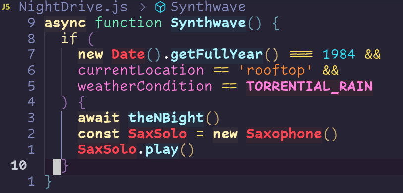
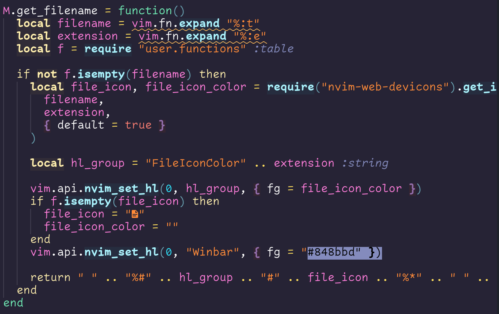

Created with [colorgen-nvim](https://github.com/ChristianChiarulli/colorgen-nvim)

***NOTE*** Still a work in progress!

## Installation

```lua
use "lunarvim/synthwave84.nvim"

vim.cmd[[colorscheme synthwave84]] 
```

## Configuration
Here is an example with the default config. 

```lua
require 'synthwave84'.setup({
  glow = {
    error_msg = true,
    type2 = true,
    func = true,
    keyword = true,
    operator = false,
    buffer_current_target = true,
    buffer_visible_target = true,
    buffer_inactive_target = true,
  }
})
```

## Demo

 
 

## Credit & References

[synthwave84](https://github.com/robb0wen/synthwave-vscode)
